# Quantum deep field for molecule

<div align='center'>
<p></p>
</div>

## Overview

This repository provides a simple implementation of the quantum deep field
(QDF) framework for molecules proposed in our study as follows.

> Masashi Tsubaki and Teruyasu Mizoguchi  
> **Quantum deep field: data-driven wave function, electron density generation, and energy prediction and extrapolation with machine learning**  
> Physical Review Letters, 2020  
> https://journals.aps.org/prl/abstract/10.1103/PhysRevLett.125.206401  

> Masashi Tsubaki and Teruyasu Mizoguchi  
> **On the equivalence of molecular graph convolution and molecular wave function with poor basis set**  
> Advances in Neural Information Processing Systems, 2020  
> https://proceedings.neurips.cc/paper/2020/hash/1534b76d325a8f591b52d302e7181331-Abstract.html

QDF is a machine learning model that
provides the electron density &rho; of molecules
by learning the atomization energy E of molecules
on a large dataset (e.g., the QM9 dataset [1]).
The QDF model involves a linear component
(i.e., the linear combination of atomic orbitals, LCAO [2])
and two nonlinear components
(i.e., the energy functional and the Hohenberg-Kohn map [3]),
in which the latter two are implemented by deep neural network (DNN)
(see the above figure).
In particular, the DNN-based Hohenberg-Kohn map serves as a physical,
external potential constraint on &psi; (i.e., the Kohn-Sham molecular orbitals)
in learning the energy functional E = F[&psi;] based on the density functional theory.
For more details read our papers, in which the NeurIPS paper provides
the equivalence and difference between LCAO and graph neural networks
or graph convolutional networks for molecules.

<div align='center'>
<p>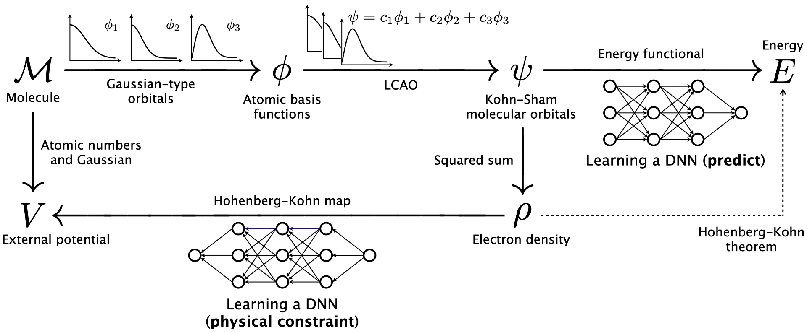</p>
</div>

In the following, we describe the detailed usage of this repository.


## Characteristics
- This implementation is easy to use and understand for beginners.
- You can train a QDF model with the properties (e.g., the atomization energy,
  homo, and lumo) in the QM9 dataset by running only two commands.
- You can predict the properties of new molecules using the pre-trained QDF models,
  which are already provided in this repository, by running only two commands.
- You can train a QDF model with your dataset
  and predict the property of your molecules using your pre-trained QDF model.


## Requirements

- [PyTorch](https://pytorch.org/) (of course, numpy and scipy)
- [Mayavi](https://docs.enthought.com/mayavi/mayavi/)
  (option to generate the electron density map)

We recommend the use of a GPU for training the QDF model.
Note that we confirm the error caused by num_workers>0
with Python>=3.6 Pytorch 1.7 on MacOS CPU,
which is reported as [this issue](https://github.com/pytorch/pytorch/issues/46409).


## Usage

#### (1) Clone or download the script

```
$ git clone https://github.com/masashitsubaki/QuantumDeepField_molecule.git
$ cd QuantumDeepField_molecule
$ ls
dataset     train       output          pretrained_model
predict     demo        README.md       figure
```

This repository provides some property datasets extracted from QM9
in the dataset directory (for details, see the Datasets section).

```
$ cd dataset
$ ls
QM9under7atoms_atomizationenergy_eV  # Very small dataset for trial.
QM9under14atoms_atomizationenergy_eV
QM9over15atoms_atomizationenergy_eV.zip  # Only test.txt.
QM9full_atomizationenergy_eV.zip
QM9under7atoms_homolumo_eV  # Trial dataset for homo lumo (i.e., multiple properties).
QM9full_homolumo_eV.zip
yourdataset_property_unit  # Empty.
```

Please unzip the zip files beforehand.


#### (2) Train a QDF model with the QM9 dataset

With a dataset in the dataset directory, you can train a QDF model
by running the two commands as follows.

```
$ cd train
$ bash preprocess.sh
$ bash train.sh
```

These two shell scripts and their explanations are as follows.

<div align='center'>
<p>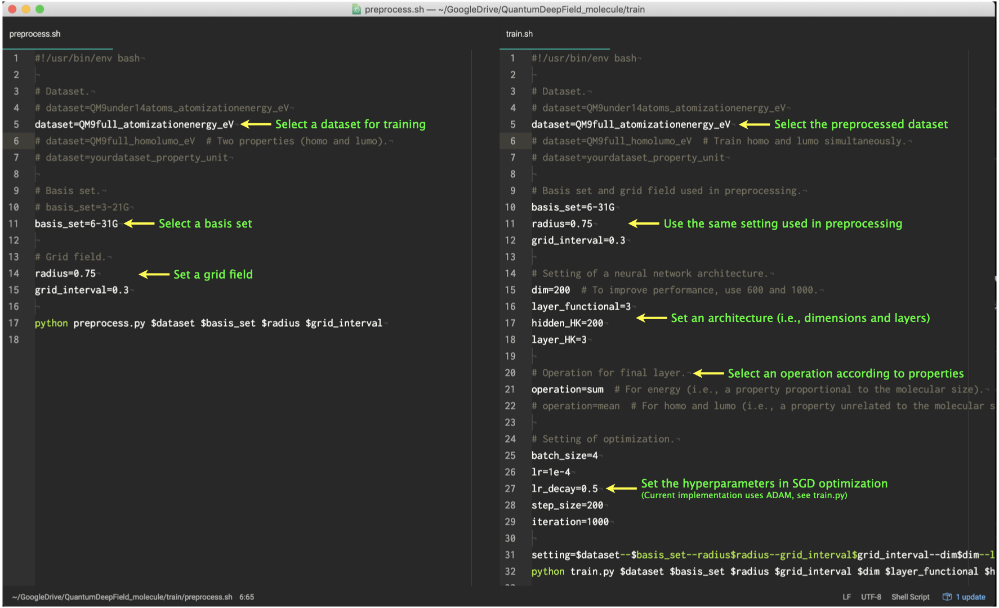</p>
</div>

You can vary these hyperparameters and train various models.
After running each command, your terminal is displayed as follows.

<div align='center'>
<p>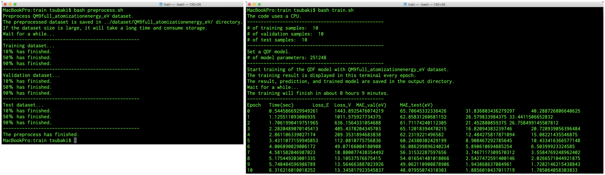</p>
</div>

After training the QDF model,
the result file is saved in the output directory (left)
and we can describe the learning curve (right) from the file as follows.

<div align='center'>
<p>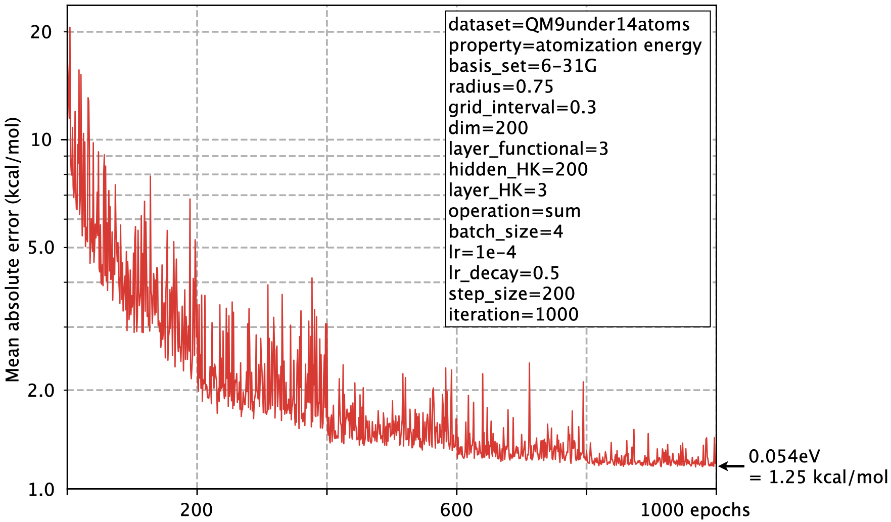</p>
</div>

Using the above hyperparameters, you can completely reproduce this result.


#### (3) Predict a property of molecules using the pre-trained QDF model

Actually, we have already trained some QDF models
and provide them in the pretrained_model directory.
Using a pre-trained QDF model, you can predict the property of new molecules
by running the two commands as follows.

```
$ cd predict
$ bash preprocess.sh
$ bash predict.sh
```

These two shell scripts and their explanations are as follows.

<div align='center'>
<p>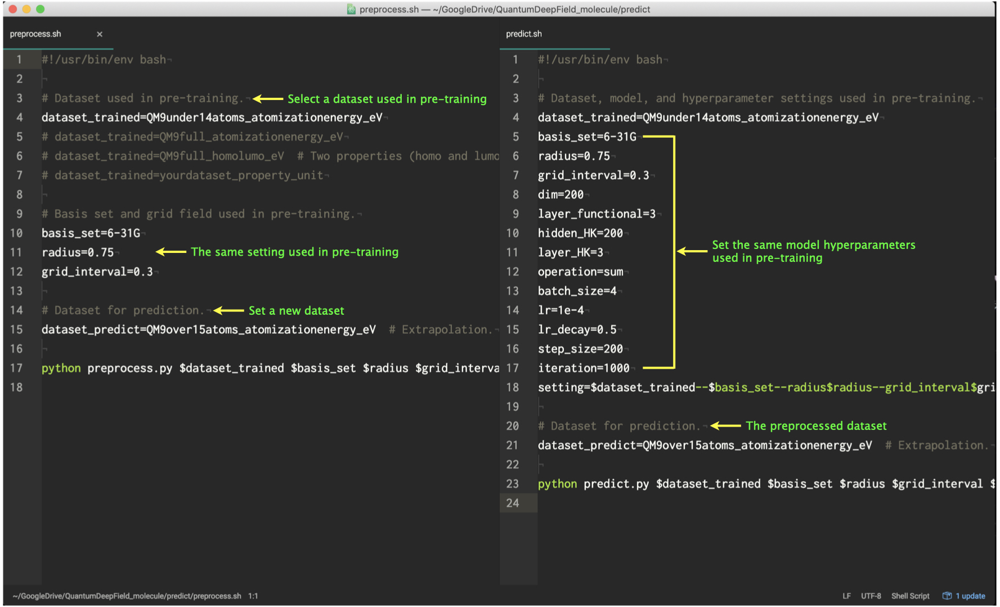</p>
</div>

You can vary the pre-trained QDF model and predict various properties.
After running each command, your terminal is displayed (left)
and the result file is saved in the output directory (right) as follows.

<div align='center'>
<p>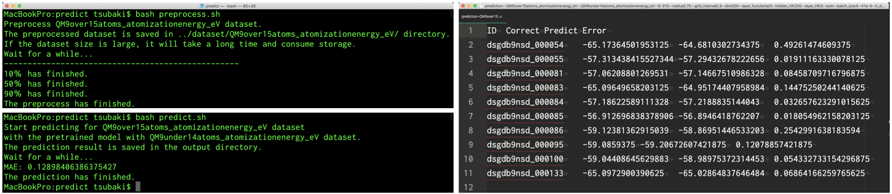</p>
</div>

If you predict the QM9over15atoms dataset
using the pre-trained model with the QM9under14atoms dataset,
you can reproduce the extrapolation prediction result as follows.

<div align='center'>
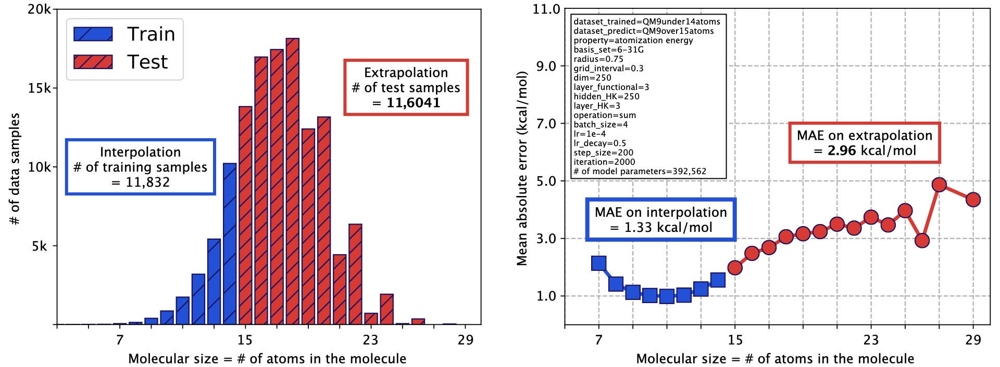</p>
</div>

We obtained the mean absolute error (MAE) less than 3.0 kcal/mol on the QM9over15atoms dataset.
Note that since we varied the hyperparameters after publishing,
the above MAEs on interpolation and extrapolation are different from that of our original papers.
This is the result of an attempt to reduce the learning parameters
and improve the extrapolation performance; this will be updated in the future.
The above extrapolation result is also saved in the output directory.


## Datasets

The QM9full dataset provided in this repository contains 130832 samples;
the [original QM9 dataset](https://springernature.figshare.com/collections/Quantum_chemistry_structures_and_properties_of_134_kilo_molecules/978904)
contains 133885 samples but we removed 3053 samples that
[failed the consistency check](https://springernature.figshare.com/articles/dataset/Uncharacterized%3A_List_of_3054_molecules_which_failed_the_geometry_consistency_check/1057644)
(i.e., 130832 = 133885 - 3053).

We note that, as described in [README of the QM9 dataset](https://springernature.figshare.com/articles/dataset/Readme_file%3A_Data_description_for__Quantum_chemistry_structures_and_properties_of_134_kilo_molecules_/1057641),
the original QM9 dataset provides U<sub>0</sub>
as the internal energy at 0 K in units of Hartree.
We transformed the internal energy into the atomization energy E in units of eV,
which can be calculated using [Atomref of the QM9 dataset](https://springernature.figshare.com/articles/dataset/Atomref%3A_Reference_thermochemical_energies_of_H%2C_C%2C_N%2C_O%2C_F_atoms./1057643),
that is, E = U<sub>0</sub> - sum(Atomrefs in the molecule), and 1 Hartree = 27.2114 eV.

In this way, we created the atomization energy dataset,
extracted the QM9under14atoms and QM9over15atoms datasets from it,
and provided them in the dataset directory (note that
the QM9over15atoms contains only test.txt for extrapolation evaluation).
On the other hand, the homolumo dataset does not require such preprocessing
and we only transformed their units from Hartree into eV.
The final format of the preprocessed QM9 dataset is as follows.

<div align='center'>
<p>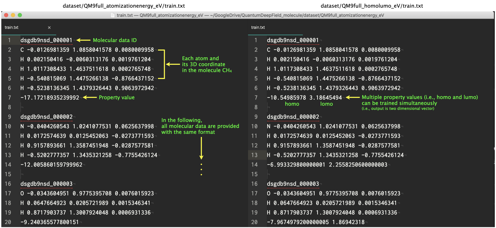</p>
</div>

Note that our QDF model can learn multiple properties simultaneously
(i.e., the model output has multiple dimensions)
when the training dataset format is prepared as the same as the above QM9full_homolumo_eV.


## Train a QDF model with your dataset

If you prepare your dataset using the same format as the above QM9 dataset,
you can train a QDF model with your dataset and others
by running the two shell scripts (i.e., preprocess.sh and train.sh).
In the dataset directory, we divide the dataset into
the training, validation, and test sets; therefore,
if you prepare the training set with the publicly available data and train it,
you can predict your (e.g., in-house) data as the test set.


## Predict your dataset using the pre-trained QDF model

Of course, if you prepare your dataset,
you can predict your dataset using the pre-trained QDF model
by running the two shell scripts (i.e., preprocess.sh and predict.sh).
We have already provided some pre-trained models in the pretrained_model directory;
we will provide various models in the future.

We note that the provided pre-trained QDF models
have been trained with the QM9 dataset, which contains
small organic molecules made up of H, C, N, O, and F atoms.
Therefore, if your dataset contains other atoms (e.g., S and Cl)
that do not appear in the QM9 dataset, you receive the following warning.

<div align='center'>
<p>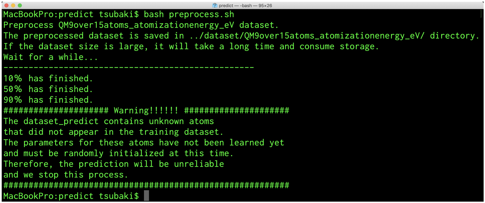</p>
</div>

If you would like to predict the molecules including S and Cl atoms,
train a QDF model with the Alchemy dataset [4].
However, the current implementation only considers the standard basis set
(e.g., 3-21G and 6-31G) for H, C, N, O and F atoms in the QM9 dataset.
For S, Cl, and other heavier atoms in the Alchemy dataset,
you will need to add a script to consider the basis set
for such heavy atoms in preprocess.py as follows.

<div align='center'>
<p>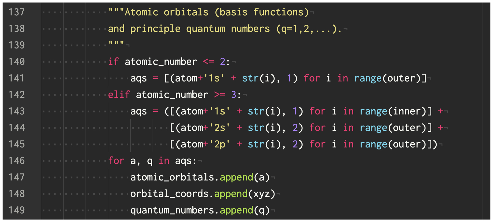</p>
</div>


## Extension

As we have discussed in our papers, for example we need to improve the current
(a) simplified Gaussian-type orbitals in terms of the spherical harmonics
(e.g., use the Slater-type orbitals),
(b) Gaussian external potential [3] that is a simplified potential
(e.g., to better describe the potential and density close to the nucleus),
and (c) vanilla feed-forward DNNs (e.g., add the residual connections).
Such model extensions can be created by forking this repository.

<div align='center'>
<p></p>
</div>


## Generate the electron density map (work in progress)

In addition to property prediction, you will be able to generate
the electron density map of molecules by a command in the future.

<div align='center'>
<p>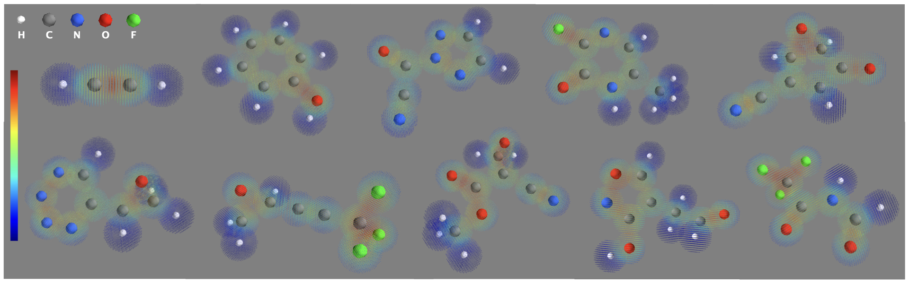</p>
</div>


## Demo (work in progress)

We are now preparing an online demo
(we provide the script in the demo directory)
for predicting the molecular properties using the pre-trained QDF models.


## How to cite

```
@article{PhysRevLett.125.206401,
  title = {Quantum Deep Field: Data-Driven Wave Function, Electron Density Generation, and Atomization Energy Prediction and Extrapolation with Machine Learning},
  author = {Tsubaki, Masashi and Mizoguchi, Teruyasu},
  journal = {Phys. Rev. Lett.},
  volume = {125},
  issue = {20},
  pages = {206401},
  numpages = {6},
  year = {2020},
  month = {Nov},
  publisher = {American Physical Society},
  doi = {10.1103/PhysRevLett.125.206401},
  url = {https://link.aps.org/doi/10.1103/PhysRevLett.125.206401}
}

@article{tsubaki2020equivalence,
  title={On the equivalence of molecular graph convolution and molecular wave function with poor basis set},
  author={Tsubaki, Masashi and Mizoguchi, Teruyasu},
  journal={Advances in Neural Information Processing Systems},
  volume={33},
  year={2020}
}
```


## References
[1] Ramakrishnan et al., Quantum chemistry structures and properties of 134 kilo molecules, Scientific Data, 2014.
\
[2] McQuarrie and Simon, Physical chemistry: A molecular approach, University Science Books Sausalito, 1997.
\
[3] Brockherde et al., Bypassing the Kohn-Sham equations with machine learning, Nature Communications, 2017.
\
[4] Chen et al., Alchemy: A quantum chemistry dataset for benchmarking ai models, arXiv preprint, 2019.
